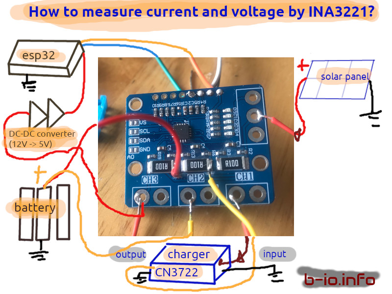
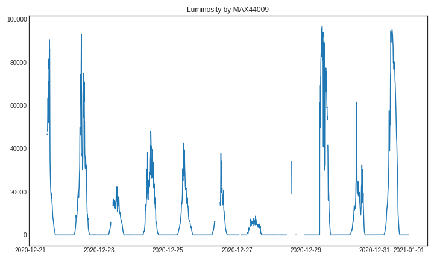
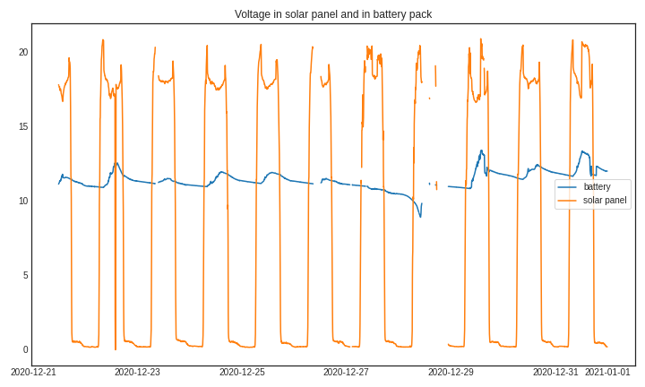
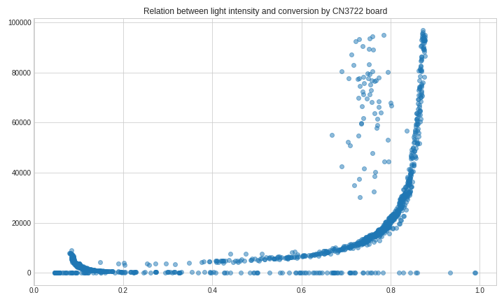

# solar-catcher
Measuring solar energy captured from 20Wp solar and measured by TI INA3221 sensor

# Basic wiring concept

  
  
# Luminosity sample

  

# Voltages from the panel and to the battery

  
  
# Conversion efficiency by CN3722

  
  
# Tutorial on my website
<a href="https://b-io.info/tutorials/sunlight-catcher/">Building 20Wp solar catcher b-io.info</a>

